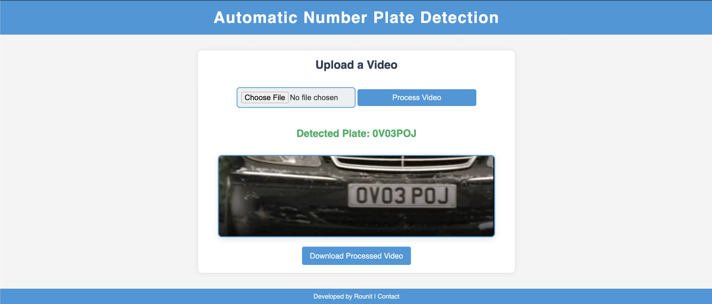

# 🚗 Automatic Car Number Plate Detection

<p align="center">
  
</p>

---

## 📌 Overview

This project is a **Flask-based web application** that allows users to upload videos, processes them using **OpenCV** and **EasyOCR**, and detects car number plates.

The system:
- Highlights detected plates in the video
- Validates them using a regex pattern
- Outputs the **most common valid number plate** detected

---

## ✨ Features

- **📤 Upload Video**: Users can upload `.mp4`, `.avi`, or `.mov` video files.
- **🔍 Automatic Plate Detection**: Detection using contour detection and **Optical Character Recognition (OCR)** via **EasyOCR**.
- **✅ Plate Validation**: Plates are validated using a regex pattern that ensures 7 uppercase characters.

  > Regex pattern used:  
  ```python
  plate_pattern = re.compile(r'^[A-Z0-9]{7}$')

 ## ⚙️ Tech Stack
- Frontend: HTML5, CSS3 (Jinja Templates)

- Backend: Flask (Python)

- Computer Vision: OpenCV, EasyOCR

- Video Processing: Contour detection, Canny edge detection

- File Handling: Secure upload and processing of video files

## 🛠️ Installation
bash
Copy
Edit
# Clone the repository
git clone https://github.com/username/repo-name.git

# Navigate into the project folder
cd repo-name

# Set up a virtual environment (optional but recommended)
python3 -m venv env
source env/bin/activate  # On Windows, use `env\Scripts\activate`

# Install dependencies
pip install -r requirements.txt
🚀 How to Run
bash
Copy
Edit
# Activate the environment
source env/bin/activate  # or `env\Scripts\activate` on Windows

# Run the Flask app
python app.py
Then open your browser and visit: http://127.0.0.1:5000/

## 📁 Project Structure
php
Copy
Edit
├── app.py                 # Main Flask application
├── static/                # Processed video outputs and styles
├── uploads/               # Uploaded video files
├── templates/             # HTML templates (frontend)
├── images/                # Screenshots or assets
├── requirements.txt       # Python dependencies
└── README.md              # This file
## 🧪 Usage
- Upload a video file via the homepage. (Sample videos available in the uploads/ folder.)

- The system detects valid number plates and displays the most frequently occurring one.

- The processed video with highlighted plates will be shown on screen and available for download.
